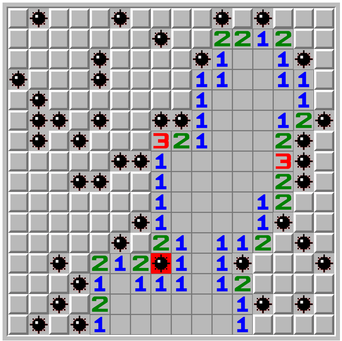

[](https://github.com/manuelhenke/minesweeper-for-web/actions/workflows/publish.yml)

# minesweeper-for-web

This is the classic Microsoft Minesweeper-Game as a WebComponent. Once you integrate it as described further, the game just follows the [standard rules](https://www.instructables.com/id/How-to-beat-Minesweeper/). To place a flag just press `ctrl`, `alt` or the meta key while clicking on a field.

# Getting Started

Install the package via `npm` or `yarn` and deliver the script to the user.
This can be done via `import`, `require` or just inserting a `script` tag.

```shell
npm i minesweeper-for-web
```

```shell
yarn add minesweeper-for-web
```

# Usage

## Basic usage

Just a basic 9x9 / 10 Mines minesweeper game. You can **combine** further examples.

```html
<minesweeper-game></minesweeper-game>
```

## Provide left-bomb-counter container

To keep the user informed how many mines are there left, after subtracting the number of placed flags, just provide a container for the counter.

```html
<p><span id="bomb-counter"></span> Mines</p>
<minesweeper-game bomb-counter-selector="#bomb-counter"></minesweeper-game>
```

## Provide a restart button

You can provide a selector where a "click"-event will be attached to, to restart the game.

```html
<minesweeper-game restart-selector="#restart-game-button"></minesweeper-game>
<button id="restart-game-button">Restart!</button>
```

## Trigger Restart via JavaScript

You can write your own custom logic to restart the game.

```html
<minesweeper-game id="minesweeper"></minesweeper-game>
<button id="restart-game-button-confirm">Restart with Confirm!</button>
```

```javascript
window.addEventListener('DOMContentLoaded', () => {
  const minesweeper = document.getElementById('minesweeper');

  document
    .getElementById('restart-game-button-confirm')
    .addEventListener('click', e => {
      e.preventDefault();
      if (window.confirm('Are you sure, that you want to restart the game?')) {
        minesweeper.restartGame();
      }
    });
});
```

## Custom win/lose callbacks

You can attach EventListener for the win-/lose-events.

```html
<minesweeper-game id="minesweeper"></minesweeper-game>
```

```javascript
window.addEventListener('DOMContentLoaded', () => {
  const minesweeper = document.getElementById('minesweeper');

  minesweeper.addEventListener('game-won', () => {
    console.log('win');
  });

  minesweeper.addEventListener('game-lost', () => {
    console.log('lose');
  });
});
```

## Custom win/lose callbacks

You can attach EventListener for the win-/lose-events.

```html
<minesweeper-game id="minesweeper"></minesweeper-game>
```

```javascript
window.addEventListener('DOMContentLoaded', () => {
  const minesweeper = document.getElementById('minesweeper');

  minesweeper.addEventListener('field-click', event => {
    // event.detail.field containts the html element of the clicked field
    // It has the data-row and data-column attributes
    // Currently there is no clean way to identify which type of field it is:
    // Number, Bomb, Flag or Questionmark before and after
    console.log(event.detail.field);
  });
});
```

## Different initial game configurations

Of course you can provide different configurations for the game.

```html
<minesweeper-game rows="30" columns="16" bombs="99"></minesweeper-game>
```

## Providing a selectable gamemode

Furthermore you can implement some own logic to create a selectable gamemode

```html
<select name="select-game-mode" id="select-game-mode">
  <option value="easy" selected>Easy - 9x9 / 10 Mines</option>
  <option value="normal">Normal - 16x16 / 40 Mines</option>
  <option value="hard">Hard - 16x30 / 99 Mines</option>
</select>

<minesweeper-game id="minesweeper"></minesweeper-game>
```

```javascript
window.addEventListener('DOMContentLoaded', () => {
  function getGameModeConfiguration(currentGameMode) {
    switch (currentGameMode) {
      case 'hard':
        return {
          columns: 30,
          rows: 16,
          bombs: 99,
        };
      case 'normal':
        return {
          columns: 16,
          rows: 16,
          bombs: 40,
        };
      case 'easy':
      default:
        return {
          columns: 9,
          rows: 9,
          bombs: 10,
        };
    }
  }

  const minesweeper = document.getElementById('minesweeper');

  document.getElementById('select-game-mode').addEventListener('change', e => {
    e.preventDefault();

    const gameModeConfiguration = getGameModeConfiguration(e.target.value);
    minesweeper.setGameModeConfiguration(gameModeConfiguration);
  });
});
```

# Example

You can try it at [CodePen](https://codepen.io/manuelhenke/pen/ExoPKLZ) or just take a look at the [demo.html](demo.html) included in this project.


# Icons Copyright

All rights for the icons used in this project belongs to their original creators: https://commons.wikimedia.org/wiki/Category:Minesweeper
The icons "bomb_red.svg" and "bomb.svg" are based on "number-0.svg" and "flag_missed.svg" is based on "bomb.svg".
